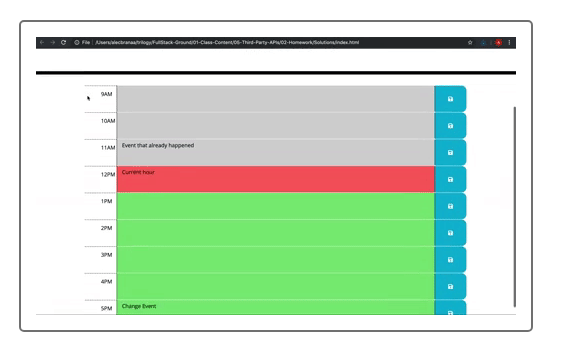
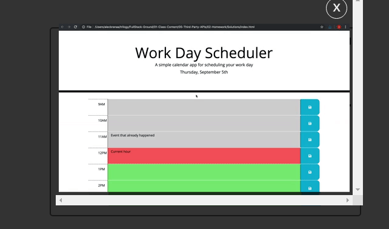
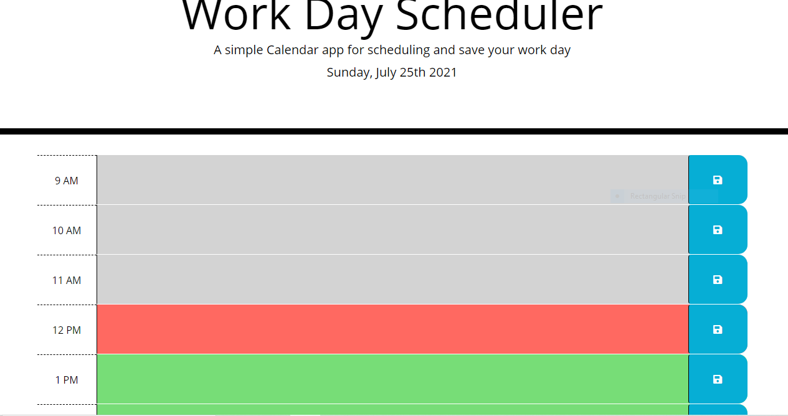

# Work Day Scheduler Starter Code
# Psuedo Code
# Requirement
create a Time Block that represents normal work time 9am to 5pm
Make the blocks have areas where description or text can be added
create functions to represent current time
colour code time blocks to indicate past present or future text
save enter and store in local storage
When refresh the save data should still be on the schedule

#### Mock UP ####

## Final Project

# Deploying my Project
[My Project](https://jahneo.github.io/Work-_Day_Scheduler)

### Issues and problems
Not too verse on how to loop a function to get items stores in local storage.
Made several attempt and had to delete several codes in the file
Attempted to make fields movable using examples from Taskmaster Pro but was unsuccessful